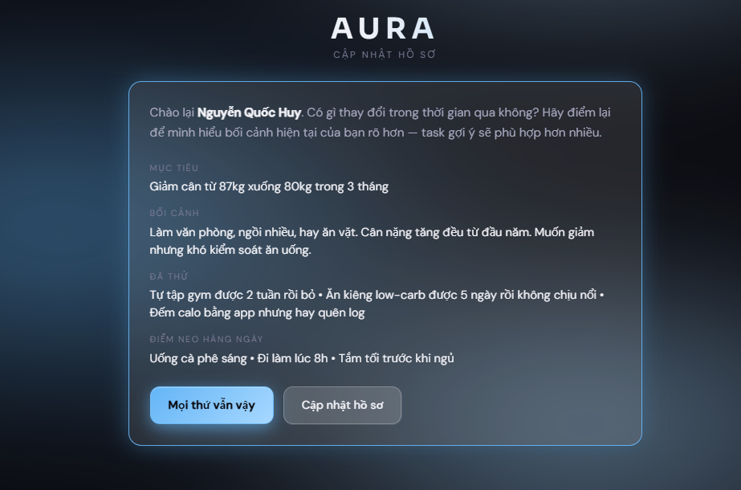
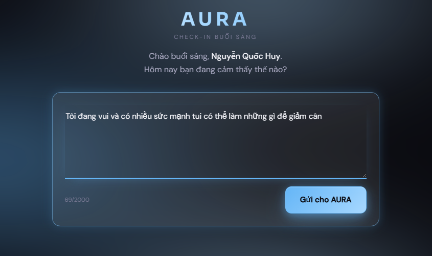
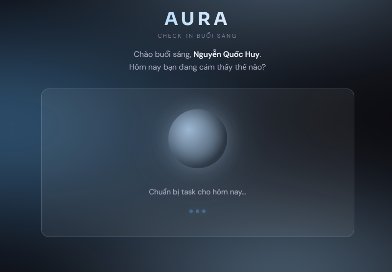
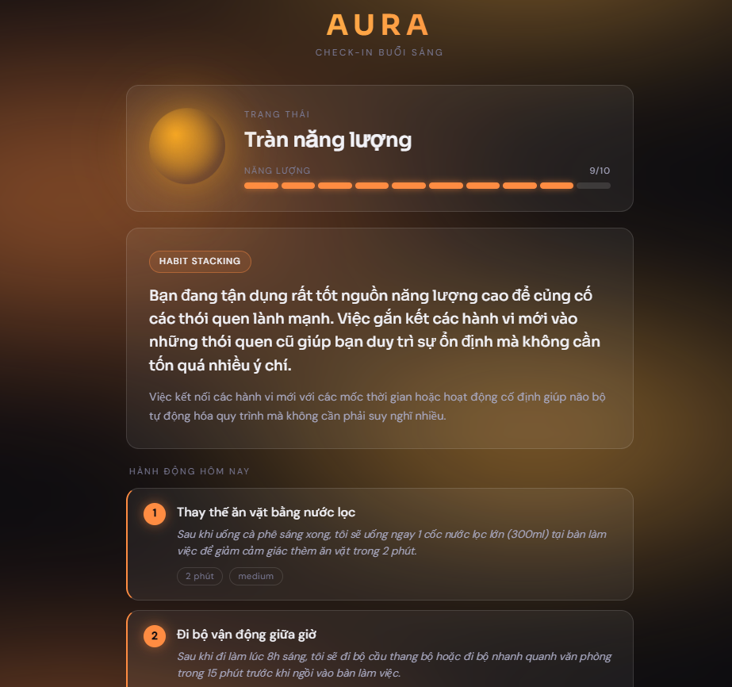
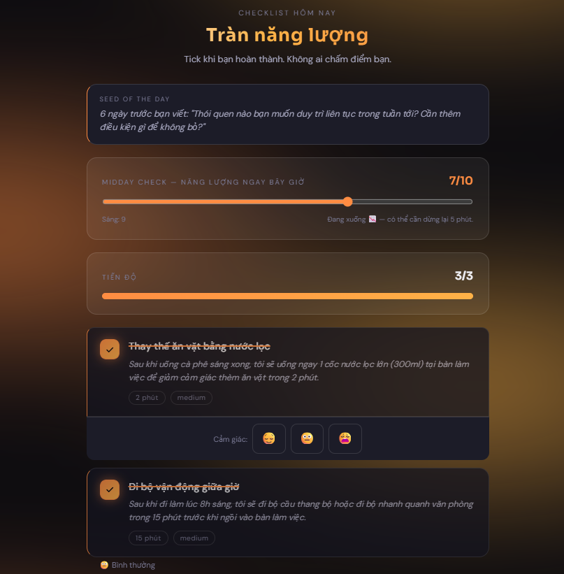
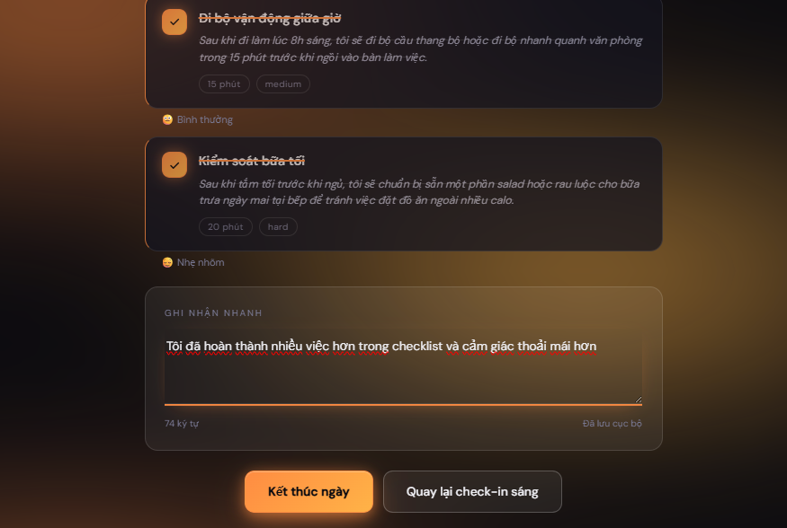
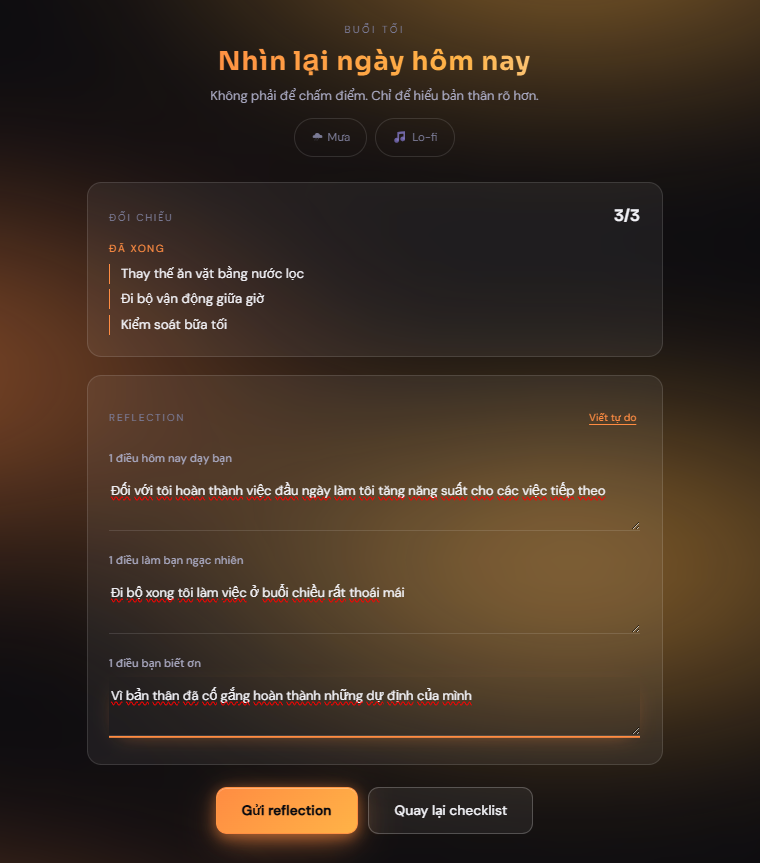
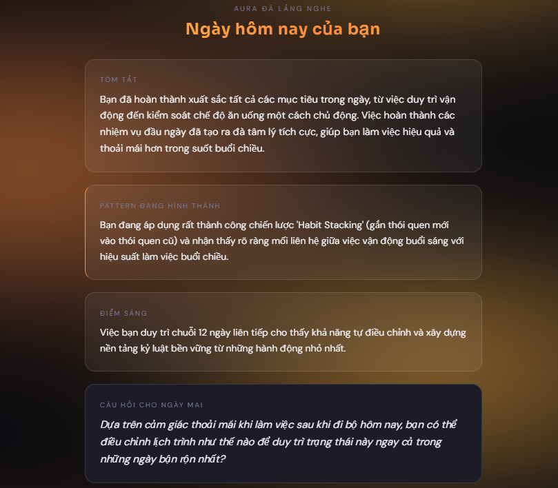
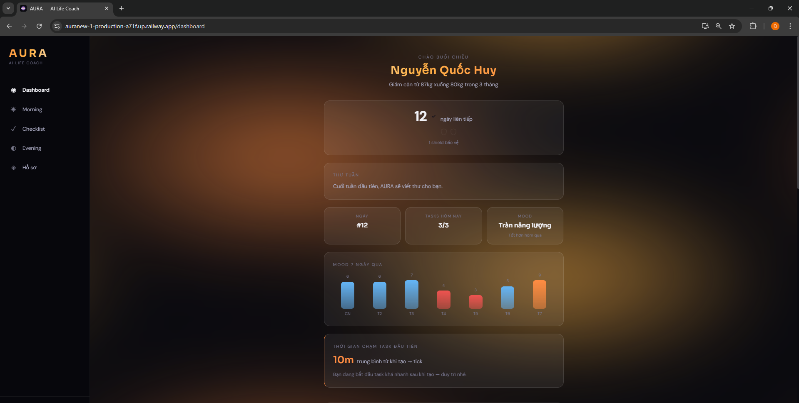
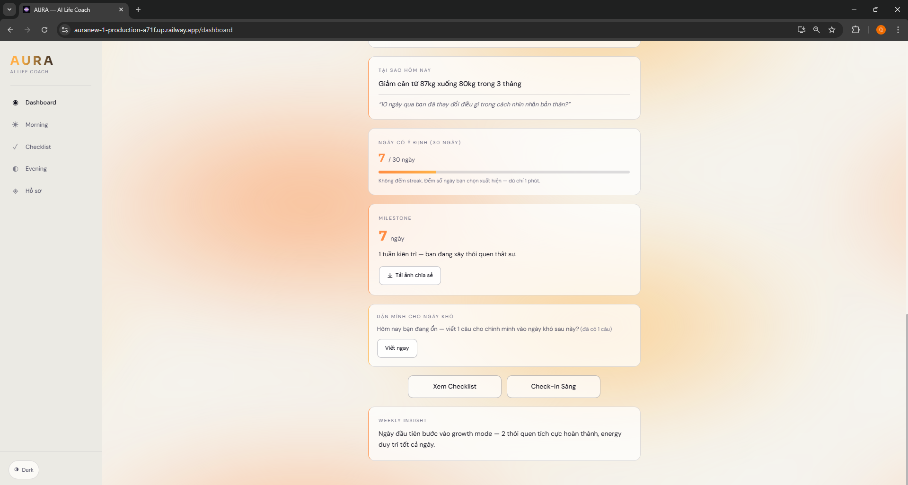

# AURA — Artificial Understanding & Resolving Assistant

> Pipeline tâm lý học hành vi: phân tích trạng thái → chọn framework can thiệp → tạo task vừa sức — mỗi ngày một lần, không phán xét.


**Single-user MVP** — Personal AI life coach for one user at a time.

---

## 1. Vấn Đề

Người ở giai đoạn 20–35 tuổi khi burnout hoặc stuck thường biết mình cần làm gì — nhưng không làm được. Không phải thiếu thông tin, mà là sai framework tâm lý cho đúng thời điểm.

Chatbot thông thường trả lời giống nhau bất kể người dùng đang kiệt sức hay bình thường — "Hãy lập kế hoạch!", "Hãy chia nhỏ mục tiêu!" — không phân biệt learned helplessness với inertia, shame spiral với procrastination đơn thuần.

AURA không khuyên bảo. AURA đọc trạng thái, nhận diện pattern, rồi chọn đúng công cụ can thiệp — như một therapist biết hôm nay bạn cần gì khác hôm qua.

---

## 2. Giải Pháp: Agentic Pipeline, Không Phải Chatbot

AURA là một pipeline 5 agent chạy tuần tự. Mỗi agent có một nhiệm vụ độc lập, output của agent trước là input của agent sau. Không có hội thoại tự do — chỉ có structured reasoning.

### Luồng buổi sáng (4 agent)

```
┌─────────────────────────────────────────────────────────┐
│                     USER INPUT                          │
│          "Hôm nay tôi cảm thấy..." (free text)         │
└───────────────────────┬─────────────────────────────────┘
                        │
                        ▼
          ┌─────────────────────────┐
          │   Agent 1: Wellness     │
          │   Check                │
          │                        │
          │  → mood_state          │
          │  → energy_level (1-10) │
          │  → risk_flag           │
          └──────────┬──────────────┘
                     │
          risk_flag? ├──YES──► Crisis Support Mode
                     │         (dừng pipeline, hiện
                     │          đường dây hỗ trợ)
                     │NO
                     ▼
          ┌─────────────────────────┐
          │   Agent 2: Psychology   │
          │   Insight               │
          │                        │
          │  Pattern Alert check:   │
          │  shame spiral /        │
          │  learned helplessness /│
          │  avoidance loop         │
          │                        │
          │  → framework (1/8)     │
          │  → explanation (VI)    │
          └──────────┬──────────────┘
                     │
                     ▼
          ┌─────────────────────────┐
          │   Agent 3: Task         │
          │   Generator              │
          │                        │
          │  Rule engine (Python):  │
          │  energy 1-3 → 1 task  │
          │  energy 4-6 → 2 tasks │
          │  energy 7-10 → 3 tasks │
          │                        │
          │  → tasks[] với         │
          │    Implementation      │
          │    Intention           │
          └──────────┬──────────────┘
                     │
                     ▼
          ┌─────────────────────────┐
          │  Lưu history.json       │
          │  + Hiển thị UI          │
          └─────────────────────────┘
```

### Luồng buổi tối (Agent 4) + Hàng tuần (Agent 5)

```
Buổi tối:  user_reflection + completed_tasks
               → Agent 4: Reflection
               → summary + pattern_detected + tomorrow_question
               → Cập nhật history.json

Chủ nhật:  history_7_days + profile + patterns
               → Agent 5: Weekly Letter
               → Thư cá nhân 200-400 từ (tiếng Việt)
               → Lưu vào history[sunday].weekly_letter
```

---

## 3. Demo — Luồng Sử Dụng Thực Tế

### Bước 1 — Hồ sơ cá nhân

Mỗi lần mở app, AURA hiển thị lại hồ sơ để người dùng xác nhận hoặc cập nhật. Mục tiêu, bối cảnh cuộc sống, những gì đã thử và thất bại, thói quen hiện có — tất cả trở thành context cho pipeline AI.



---

### Bước 2 — Check-in buổi sáng

Người dùng viết tự do về trạng thái hiện tại. Không cần format, không cần chọn từ danh sách. AURA đọc ngôn ngữ tự nhiên và suy luận từ đó.



---

### Bước 3 — Pipeline đang chạy

Sau khi gửi, 3 agent chạy tuần tự (Wellness → Psychology → Task Generator). Trung bình 8–15 giây. MoodOrb hiển thị trạng thái xử lý — người dùng biết hệ thống đang làm gì, không phải bị treo.



---

### Bước 4 — Kết quả: Framework + Tasks

Agent 2 chọn framework phù hợp (ở đây: **Habit Stacking** vì energy 9/10, mood energized). Agent 3 tạo 3 tasks với Implementation Intention — mỗi task có trigger cụ thể, địa điểm, thời lượng, độ khó.

Background aura chuyển sang cam — màu của mood *energized*.



---

### Bước 5 — Checklist trong ngày

Trong ngày người dùng vào Checklist để tick task hoàn thành, ghi nhận cảm xúc sau mỗi task (emoji reaction), và theo dõi energy midday so với buổi sáng. Seed of the day nhắc lại câu hỏi từ 6 ngày trước.



---

### Bước 6 — Ghi chú nhanh + Kết thúc ngày

Sau khi tick xong task, người dùng có thể ghi chú nhanh bất kỳ điều gì. Nút "Kết thúc ngày" chuyển sang Evening reflection.



---

### Bước 7 — Reflection buổi tối

Agent 4 đặt 3 câu hỏi có cấu trúc để khai thác insight: 1 điều học được, 1 điều ngạc nhiên, 1 điều biết ơn. Không phải journal tự do — câu hỏi có chủ đích để tạo dữ liệu có cấu trúc cho pattern detection.

Bên trái hiển thị đối chiếu các task đã xong trong ngày.



---

### Bước 8 — AURA phân tích ngày của bạn

Agent 4 tổng hợp toàn bộ ngày: tóm tắt, pattern đang hình thành, điểm sáng từ streak, và câu hỏi cho ngày mai — được thiết kế dựa trên dữ liệu thực tế của ngày hôm đó, không phải câu hỏi generic.



---

### Bước 9 — Dashboard tổng quan (Dark mode)

Dashboard hiển thị streak hiện tại (12 ngày liên tiếp), biểu đồ mood 7 ngày qua, tasks hôm nay, mood hiện tại so với hôm qua, và thời gian trung bình từ khi tạo task đến khi bắt đầu làm (10 phút — behavior metric, không phải vanity metric).



---

### Bước 10 — Dashboard (Light mode)

Light mode tự động điều chỉnh toàn bộ color system. Phần dưới dashboard: mục tiêu 30 ngày, milestone, tính năng "Dặn mình cho ngày khó" (viết sẵn câu động viên cho bản thân khi khó khăn), và Weekly Insight từ Agent 5.



---

## 4. RAG Lab — Hỏi Đáp Dựa Trên Tài Liệu Nội Bộ

RAG Lab là tính năng cho phép user hỏi AURA về cách hoạt động, các framework tâm lý, và nguyên tắc đằng sau hệ thống — câu trả lời được tạo từ tài liệu nội bộ, không phải kiến thức chung trên internet.

### Cách hoạt động

```
User question
    │
    ▼
POST /api/rag/query
    │
    ▼
load_rag_documents() — load .md/.txt from backend/data/rag_docs/
    │
    ▼
chunk_document() — split by paragraph, 800 chars, 120 overlap
    │
    ▼
retrieve_relevant_chunks() — lexical BM25-like scoring, top 5
    │
    ▼
_build_context() — gộp chunks thành context string
    │
    ▼
get_rag_prompt() — grounded prompt với rules (tiếng Việt, không bịa)
    │
    ▼
call_gemini() — Gemini 3.1 Flash Lite
    │
    ▼
Return: { answer, sources[], confidence, used_context }
```

### Retrieval details

| Thành phần | Chi tiết |
|-----------|----------|
| **Chunking** | paragraph-aware (split on `\n\n+`), 800 chars max, 120 chars overlap |
| **Scoring** | keyword match — count(query_terms ∩ chunk_terms) + title boost, normalized 0..1 |
| **Threshold** | keep chunks with normalized_score ≥ 0.3 |
| **No vector DB** | intentionally simple cho MVP demo |

### Tài liệu nội bộ

| File | Nội dung |
|------|----------|
| `backend/data/rag_docs/aura_overview.md` | Tổng quan AURA, architecture, tech stack, safety features |
| `backend/data/rag_docs/psychology_frameworks.md` | 8 framework tâm lý chi tiết, trigger conditions, selection logic |

### API spec

```
POST /api/rag/query
Body: { "question": "string" }
Response: {
  "answer": "string (VI)",
  "sources": [{ "title", "chunk_id", "preview", "score" }],
  "confidence": "high | medium | low",
  "used_context": boolean
}
```

### RAG Lab UI

Route: `/rag` — page mới trong navigation (biểu tượng ◎).

Tính năng UI:
- Input textarea với Ctrl+Enter shortcut
- Loading state với spinner animation
- Answer card với confidence badge (màu sắc theo mức độ)
- Sources card với title + preview (≤200 chars) + score %
- Empty state với 4 câu hỏi mẫu
- Error handling graceful

---

## 5. Psychology Framework Engine

Agent 2 chọn 1 trong 8 framework dựa trên trigger condition được phát hiện từ input và lịch sử pattern:

| Framework | Trigger condition |
|-----------|------------------|
| **80/20 Pareto** | Quá nhiều việc, không biết ưu tiên — overwhelmed by volume |
| **Behavioral Activation** | Numb, không muốn làm gì, đang chờ cảm hứng xuất hiện |
| **Implementation Intention** | Biết cần làm gì nhưng hay quên hoặc trì hoãn thực thi |
| **Habit Stacking** | Muốn thói quen mới nhưng không tìm được chỗ trong lịch |
| **Self-Compassion** | Shame spiral, miss nhiều ngày liên tiếp, tự chỉ trích nặng |
| **Progress Principle** | Mất motivation, không nhìn thấy mình đang tiến lên |
| **2-Minute Rule** | Inertia — biết rõ việc cần làm nhưng không bắt đầu được |
| **Dunning-Kruger Awareness** | Valley of despair (muốn bỏ cuộc) hoặc overconfidence |

Framework không phải gợi ý — là quyết định của Agent 2 dựa trên pattern thực tế, có thể bị override bởi Pattern Alert engine nếu phát hiện shame spiral hoặc learned helplessness lặp lại ≥ 3 ngày liên tiếp.

---

## 6. Task Generation Rule Engine

Agent 3 không được tin tưởng hoàn toàn — LLM có thể vi phạm prompt rules. Rule engine được enforce ở Python code (validate sau khi parse JSON từ Gemini):

| energy_level | Số task tối đa | Thời gian tối đa | Độ khó cho phép |
|:---:|:---:|:---:|:---|
| 1 – 3 | 1 task | 15 phút | `very_easy` only |
| 4 – 6 | 2 tasks | 30 phút tổng | `easy` hoặc `medium` |
| 7 – 10 | 3 tasks | 60 phút tổng | `medium` hoặc `hard` |

Nếu `past_attempts` trong profile có pattern bỏ cuộc với một loại task cụ thể: tránh lặp lại, chọn approach khác.

Mỗi task kèm **Implementation Intention**: "Khi [trigger], tôi sẽ [action] tại [location] trong [duration]." — giúp giảm activation energy và tăng follow-through rate.

---

## 7. Quyết Định Kỹ Thuật

### Tại sao Next.js 15 App Router?

Server Components giúp giữ API key và data fetch ở server. App Router cho phép nested layout — `MoodBody` client component apply class `mood-<state>` lên `<body>` để CSS variables của design system hoạt động mà không cần re-render toàn bộ cây component.

### Tại sao FastAPI?

Async-native và tích hợp tốt với Google Genai SDK. Pipeline 4 agent chạy tuần tự — mỗi agent là một async function call, dễ test độc lập. Pydantic models enforce output schema của từng agent trước khi truyền sang agent tiếp theo.

### Tại sao Gemini 3.1 Flash Lite?

Latency thấp (~1-2s/agent) và giá phù hợp cho MVP demo. Quan trọng hơn: model đủ mạnh để follow JSON schema nghiêm ngặt với temperature thấp, điều kiện tiên quyết để rule engine Python phía sau không bị bể.

### Tại sao JSON files thay vì SQLite?

Single-user MVP — không có auth, không có multi-user. `profile.json` và `history.json` đủ cho mọi operation cần thiết. SQLite schema đã được thiết kế (accounts, users, daily_entries, tasks) nhưng không được sử dụng — giữ lại SQLite thêm độ phức tạp mà không thêm giá trị cho demo portfolio.

Đây là quyết định có chủ đích, không phải thiếu sót kỹ thuật. Multi-user + auth là Roadmap v2.

### Tại sao không có auth?

Auth được build ở Phần 10 rồi bị remove. Lý do: JWT middleware không được enforce trên API routes trong single-user context = ảo giác bảo mật. Nguy hiểm hơn là không có auth, vì người đọc code có thể tin rằng hệ thống đã được bảo vệ khi thực ra không. Tốt hơn là thành thật: đây là local tool chạy trên máy cá nhân.

### Tại sao lexical retrieval cho RAG Lab?

MVP demo không cần vector DB phức tạp. Lexical BM25-like scoring đủ để retrieve relevant chunks từ 2-3 markdown documents. Vector DB là feature v2 khi cần scale lên hàng trăm documents hoặc cần semantic search thực sự.

---

## 8. Chạy Locally

**Prerequisites:** Docker Desktop đang chạy, Git.

```bash
# 1. Clone và vào thư mục
git clone https://github.com/Himerzt/aura.git
cd aura

# 2. Tạo file .env từ template
cp .env.example .env
# Mở .env, điền GEMINI_API_KEY
# Lấy tại: https://aistudio.google.com/apikey

# 3. Khởi động toàn bộ stack
docker-compose up --build
```

Mở trình duyệt tại **http://localhost** — Nginx reverse proxy tự route `/api/*` → FastAPI `:8000` và `/*` → Next.js `:3000`.

Lần đầu chạy sẽ mất 2–3 phút để build image. Lần sau: `docker-compose up` (không cần `--build`).

**Seed dữ liệu demo (tuỳ chọn):**

```bash
# Tạo 10 ngày lịch sử mẫu để xem Dashboard ngay
docker-compose exec backend python scripts/seed_demo.py
```

**Test RAG Lab:**

```bash
# Test backend API
curl -X POST http://localhost:8000/api/rag/query \
  -H "Content-Type: application/json" \
  -d '{"question":"AURA khác chatbot motivational ở đâu?"}'
```

---

## 9. Folder Structure

```
AURA_NEW/
├── .env.example
├── .env.vercel.example
├── docker-compose.yml
├── vercel.json
├── CLAUDE.md
├── README.md
│
├── .claude/
│   ├── settings.json
│   ├── agents/
│   └── commands/
│
├── docs/
│   ├── plan.md
│   ├── plan-rag.md
│   ├── VERCEL_DEPLOY.md
│   └── screenshots/
│
├── backend/
│   ├── Dockerfile
│   ├── requirements.txt
│   ├── main.py
│   ├── agents/
│   │   ├── _gemini.py
│   │   ├── wellness_check.py
│   │   ├── psychology_insight.py
│   │   ├── task_generator.py
│   │   ├── reflection.py
│   │   └── weekly_letter.py
│   ├── core/
│   │   ├── memory.py
│   │   ├── memory_recall.py
│   │   ├── pattern_alert.py
│   │   ├── prompts.py
│   │   ├── pipeline.py
│   │   └── rag.py
│   ├── data/
│   │   ├── profile.json
│   │   ├── history.json
│   │   └── rag_docs/
│   │       ├── aura_overview.md
│   │       └── psychology_frameworks.md
│   ├── routers/
│   │   └── api.py
│   └── scripts/
│       └── seed_demo.py
│
└── frontend/
    ├── Dockerfile
    ├── package.json
    ├── tailwind.config.ts
    ├── app/
    │   ├── layout.tsx
    │   ├── page.tsx
    │   ├── onboarding/page.tsx
    │   ├── morning/page.tsx
    │   ├── checklist/page.tsx
    │   ├── evening/page.tsx
    │   ├── dashboard/page.tsx
    │   └── rag/page.tsx          # RAG Lab
    ├── components/
    │   ├── Navigation.tsx
    │   ├── ui/
    │   └── aura/
    └── lib/
        ├── api.ts
        └── types.ts
```

---

## 10. Lessons Learned

**1. Subagent review phát hiện vấn đề mà người viết code bỏ qua.**

Auth shell (login/register routes) được build ở Phần 10 nhưng không enforce trên API — subagent review chạy độc lập không có context của người viết, nên nó đọc code theo đúng nghĩa đen và báo ngay: "JWT middleware tồn tại nhưng không được mount." Người viết code biết mình chưa wire up, nên không thấy đó là vấn đề. Reviewer không biết điều đó, nên thấy đúng vấn đề. Lesson: review process có giá trị nhất khi reviewer không có context.

**2. Over-engineering data layer là rủi ro thực, không phải lý thuyết.**

SQLite schema với 4 bảng (accounts, users, daily_entries, tasks) được thiết kế kỹ — FK constraints, indexes, migration plan. Nhưng khi nhìn lại: ứng dụng chỉ có 1 user, không có auth, không có concurrent writes. Schema phức tạp hơn mức cần thiết 10 lần. Quyết định remove và dùng 2 JSON files giúp giảm 200 dòng code, bỏ được 1 dependency (SQLAlchemy), và không mất feature nào. Lesson: data layer phù hợp với số user thực tế, không phải số user tưởng tượng.

**3. Loading UX tốt có impact cao hơn thêm feature mới.**

Pipeline 4 agent mất 8–15 giây. Ban đầu: màn hình trắng + spinner đơn giản. Sau khi thêm progress indicator 3 bước ("Đang phân tích tâm trạng... → Đang chọn framework... → Đang tạo kế hoạch..."), cảm giác chờ đợi khác hoàn toàn — người dùng biết hệ thống đang làm gì, không phải bị treo. Lesson: perceived performance quan trọng như actual performance, đặc biệt khi có AI latency không thể tránh.

**4. Tiếng Việt trong AI prompt cần test kỹ hơn tiếng Anh.**

Gemini đôi khi trộn lẫn tiếng Anh vào response tiếng Việt, đặc biệt với thuật ngữ tâm lý học. Phải explicit trong prompt: "Trả lời hoàn toàn bằng tiếng Việt. Không dùng tiếng Anh kể cả với thuật ngữ chuyên ngành — dịch hoặc giải thích bằng tiếng Việt." Và validate output sau khi parse JSON.

**5. RAG Lab: lexical retrieval đủ cho MVP, vector DB là v2.**

Đầu tiên tính năng RAG có vẻ phức tạp, cần vector embeddings, FAISS, ChromaDB... Nhưng với 2 markdown documents và câu hỏi demo portfolio, lexical BM25-like scoring + Gemini grounding cho kết quả tốt mà không cần infrastructure phức tạp. Lesson: giải pháp simple-first, scale chỉ khi cần.

---

## 11. Known Limitations

> **Trạng thái hiện tại: Single-user MVP**
>
> AURA ở phiên bản hiện tại là **công cụ cá nhân cho một người dùng duy nhất**, không phải SaaS platform. Các giới hạn dưới đây là **quyết định có chủ đích** để tập trung vào core value (pipeline tâm lý học) thay vì infrastructure — không phải thiếu sót kỹ thuật. Roadmap v2 liệt kê đầy đủ hướng mở rộng.

**Không có auth, không có multi-user.**
Không có login, không có account system, không có phân quyền. Toàn bộ dữ liệu (profile + history) dùng chung trong `backend/data/`. Nếu 2 người cùng dùng link demo cùng lúc, họ sẽ ghi đè dữ liệu của nhau. Demo live trên Railway được thiết kế cho **một người xem tại một thời điểm**. Multi-user + auth là Roadmap v2 — SQLite schema đã được thiết kế sẵn, migration path rõ ràng.

**Dữ liệu không persist qua deploy.**
Railway dùng ephemeral filesystem — mỗi lần deploy lại là `history.json` reset về demo data đã commit trong repo. Với local Docker Compose, dữ liệu tồn tại trong container cho đến khi container bị xoá. Để persist dài hạn cần mount volume.

**Không có real-time streaming.**
Pipeline 4 agent chạy tuần tự và trả về kết quả một lần sau khi xong hết. Không có streaming từng token — người dùng chờ 8–15 giây rồi thấy toàn bộ kết quả. Gemini SDK hỗ trợ streaming nhưng chưa được implement.

**Framework selection phụ thuộc vào LLM.**
Pattern Alert engine có thể override framework, nhưng lần đầu trong ngày Agent 2 vẫn dựa vào Gemini reasoning. Với input ngắn hoặc mơ hồ, framework được chọn có thể không phải optimal.

**Không có notification.**
Không có reminder buổi sáng/tối. Người dùng phải tự nhớ mở app.

**RAG Lab: tài liệu giới hạn.**
Hiện tại chỉ có 2 markdown documents (aura_overview.md + psychology_frameworks.md). Nếu hỏi về topics không có trong docs, RAG Lab sẽ trả lời "không tìm thấy" thay vì hallucinate.

---

## 12. Roadmap v2

Những gì sẽ được build nếu AURA chuyển từ personal tool sang product:

| Feature | Lý do |
|---------|-------|
| **Auth + multi-user** | Mỗi user có profile và history riêng |
| **SQLite migration** | Schema đã thiết kế sẵn, migration path rõ ràng |
| **Streaming response** | Giảm perceived latency từ 10s → hiển thị từng phần |
| **Push notification** | Reminder buổi sáng/tối theo chronotype của user |
| **Export PDF/CSV** | Weekly report để chia sẻ với therapist hoặc coach |
| **Pattern analytics** | Dashboard dài hạn — framework nào hiệu quả nhất với user này |
| **Voice input** | Gõ buổi sáng khi chưa tỉnh ngủ là friction không cần thiết |
| **RAG vector DB** | ChromaDB hoặc Pinecone khi cần semantic search trên 100+ docs |

---

*Built as a portfolio project — solo, 10 parts + RAG Lab, ~3 tuần. Stack: Next.js 15 + FastAPI + Gemini + Docker + Railway.*
